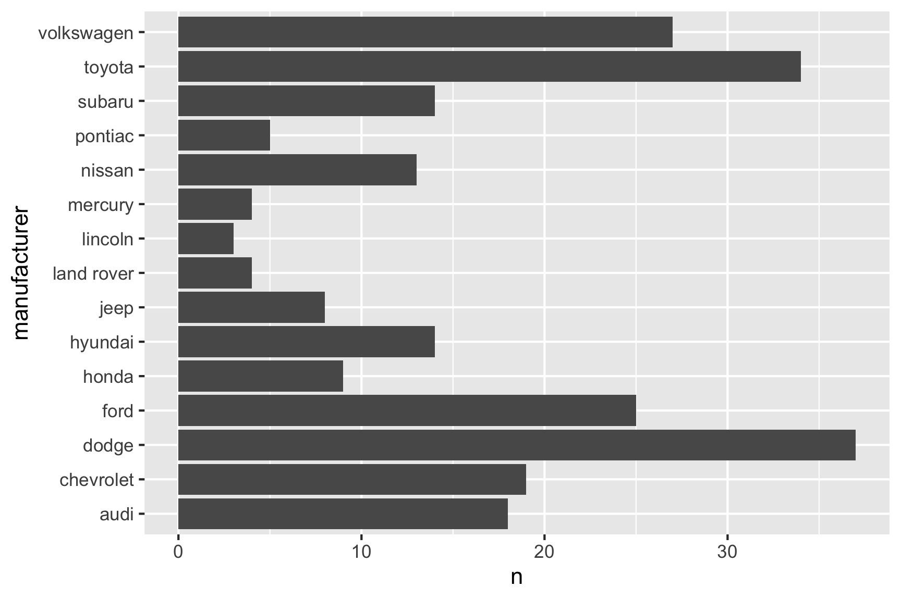
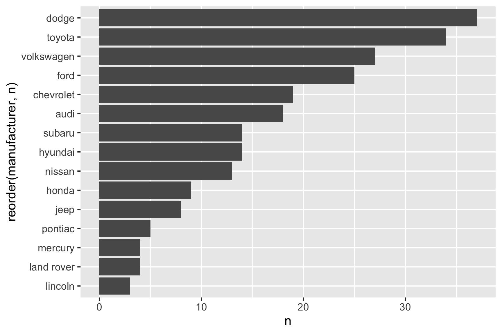
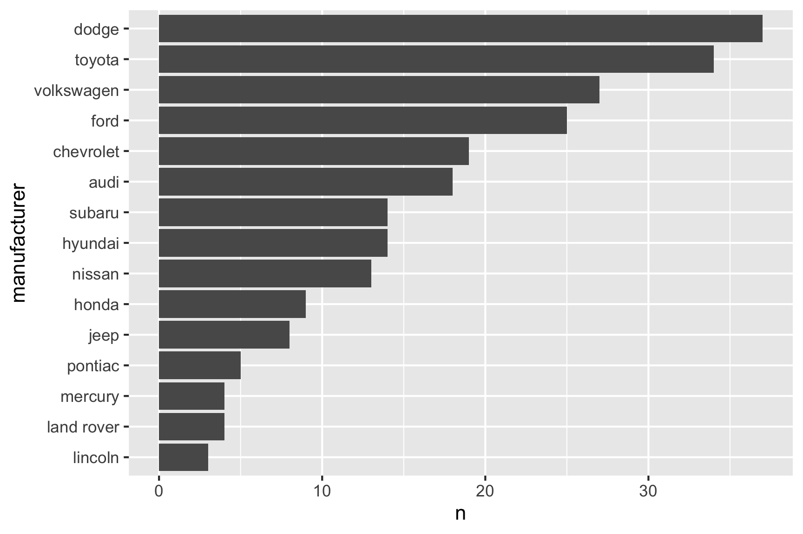
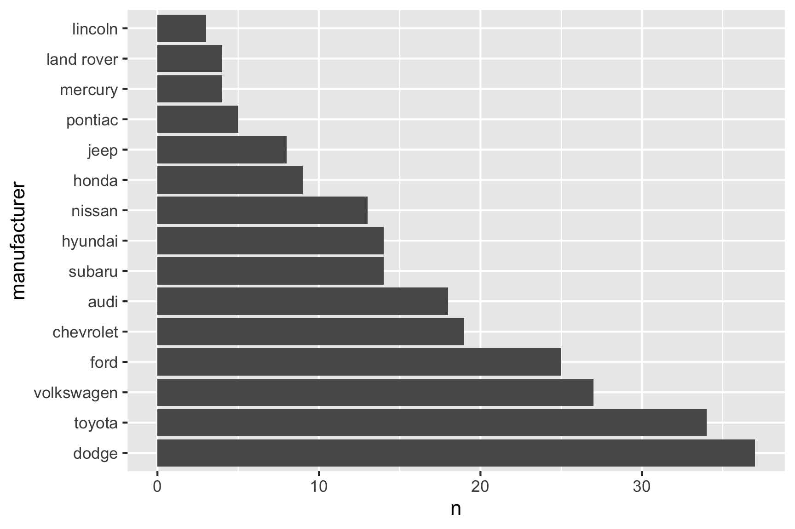

<!-- README.md is generated from README.Rmd. Please edit that file -->

# factorlock <a href='https://jhelvy.github.io/factorlock/'></a>

<!-- badges: start -->

[](https://CRAN.R-project.org/package=factorlock)
[](https://app.travis-ci.com/github/jhelvy/factorlock)
[](https://cran.r-project.org/package=factorlock)
<!-- badges: end -->

# Usage

The only thing this package does is provide the
`factorlock::lock_factors()` function to make it easier to reorder
factors in a data frame according to the row order.

## What’s the problem?

Something *very* simple like trying to sort a bar chart can be
annoyingly unintuitive, especially to beginners just getting familiar
with {ggplot2} and the {tidyverse}. Here’s an example:

``` r
library(tidyverse)

mpg %>% 
  count(manufacturer) %>% 
  ggplot() + 
  geom_col(aes(x = n, y = manufacturer))
```



This produces an unsorted bar chart. If you wanted to sort the bars
based on `n`, many people make the mistake of sorting the *data frame*
and assuming the reordered rows will pass through to the bars, like
this:

``` r
mpg %>% 
  count(manufacturer) %>% 
  arrange(n) %>% 
  ggplot() + 
  geom_col(aes(x = n, y = manufacturer))
```


**But this produces the same chart!** 🤦

To *actually* get a sorted bar chart, you have to reorder the **factor
levels**. There are many ways to do it, but typically I use `reorder()`
to change the factor level ordering like this:

``` r
mpg %>% 
  count(manufacturer) %>% 
  ggplot() + 
  geom_col(aes(x = n, y = reorder(manufacturer, n)))
```



I find this rather unintuitive and difficult to remember, let alone
confusing because the ordering of the rows in the data frame won’t match
the factor ordering (which is rather opaque to the user).

## Enter {factorlock}

This package provides the `factorlock::lock_factors()` function to
“lock” the factor ordering to that of the row ordering in the data
frame. Here’s the same example but without having to change any ggplot
code:

``` r
mpg %>% 
  count(manufacturer) %>% 
  arrange(n) %>% 
  factorlock::lock_factors() %>% 
  ggplot() + 
  geom_col(aes(x = n, y = manufacturer))
```



The use of `factorlock::lock_factors()` is just an intermediate step
that makes it easier to set the factor ordering *before* making a plot
with {ggplot2}. Notice that you also get better axis label names for
free here since the `y` variable is still mapped to just `manufacturer`
instead of `reorder(manufacturer, n)`.

By default all character or factor type variables are “locked,” but you
can also specify which variables you want to “lock” while leaving the
others alone:

``` r
mpg %>%
  count(manufacturer) %>% 
  arrange(n) %>% 
  factorlock::lock_factors("manufacturer") %>% 
  ggplot() + 
  geom_col(aes(x = n, y = manufacturer))
```


Finally, you can get a reverse factor ordering with `rev = TRUE`:

``` r
mpg %>%
  count(manufacturer) %>% 
  arrange(n) %>% 
  factorlock::lock_factors(rev = TRUE) %>% 
  ggplot() + 
  geom_col(aes(x = n, y = manufacturer))
```



# Installation

The current version is not yet on CRAN, but you can install it from
Github using the {remotes} package:

``` r
# install.packages("remotes")
remotes::install_github("jhelvy/factorlock")
```

Load the library with:

``` r
library(factorlock)
```

# Author, Version, and License Information

- Author: *John Paul Helveston* <https://www.jhelvy.com/>
- Date First Written: *October 23, 2020*
- License:
  [MIT](https://github.com/jhelvy/factorlock/blob/master/LICENSE.md)

# Citation Information

If you use this package for in a publication, I would greatly appreciate
it if you cited it - you can get the citation by typing
`citation("factorlock")` into R:

``` r
citation("factorlock")
#> 
#> To cite factorlock in publications use:
#> 
#>   John Paul Helveston (2022). factorlock: Set Factors Levels Based on
#>   Row Order.
#> 
#> A BibTeX entry for LaTeX users is
#> 
#>   @Manual{,
#>     title = {factorlock: Set Factors Levels Based on Row Order},
#>     author = {John Paul Helveston},
#>     year = {2022},
#>     note = {R package},
#>     url = {https://jhelvy.github.io/factorlock/},
#>   }
```
